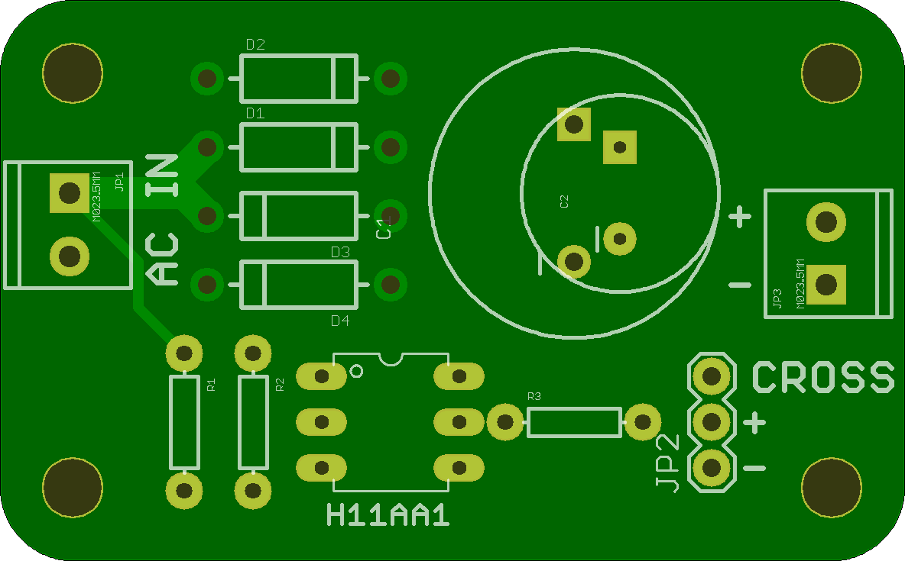
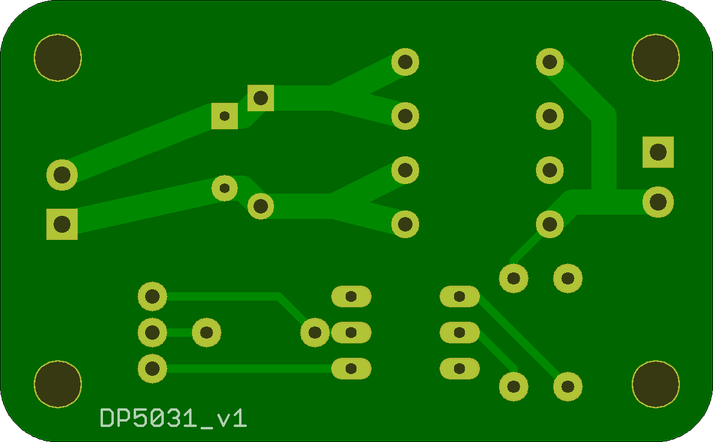

## Zero Crossing Detector and Power Supply

I used this board in my Range Rebuild to give me zero crossing detection, as well as provide power using a simple AC wall wart style transformer, and a linear regulator. 

This allows me to drive my solid state relays at zero crossing, and use the inherent frequency of the power line as the clock for a very slow PWM for power control. 

## ZeroCrossPower 

### Board dimensions

* (196851, 122047) original units
* (1.9685, 1.2205) inches
* (50.0002, 30.9999) mm

| Front | Back |
| --- | --- |
|  |  |

